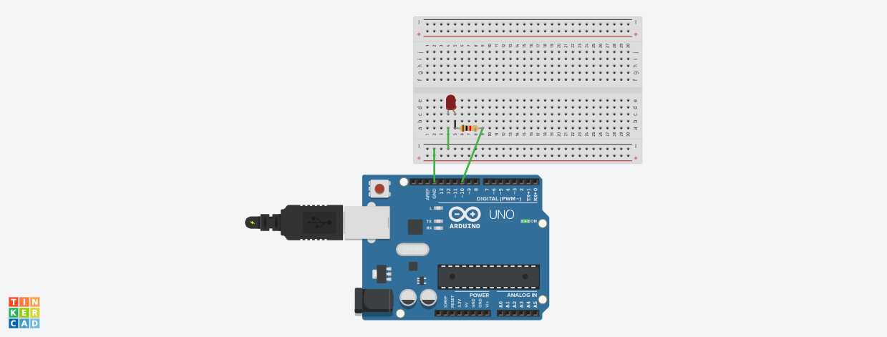

# Ponderada de programação - Arduíno
&nbsp;&nbsp;&nbsp;&nbsp; Neste Readme irei demonstrar meus resultados a partir da ponderada de programação e meu primeiro contato com arduíno, alguns dos materiais de código consegui a partir de estudo de materiais e vídeos fora do autoestudo (o morse code por exemplo).

## 1. Blinker

## 1.1. Blinker Interno

&nbsp;&nbsp;&nbsp;&nbsp; O Blinker interno é feito a partir de um led localizado na própria placa do arduíno.

[Veja o código do Blinker Interno](Código/blinkInterno.ino)

Veja o vídeo abaixo com a placa em funcionamento:

## 1.2. Blinker Externo

 Figura 1: Blink Externo 

 

Aqui está disponíveil o link do TinkerCad Para o projeto do Blinker Externo [Link Para o Blink Externo](https://www.tinkercad.com/things/fjkGjnltAA1-blink-basico/editel?returnTo=https%3A%2F%2Fwww.tinkercad.com%2Fdashboard%2Fdesigns%2Fcircuits&sharecode=K4DimDclegJvN2ogSJrshDeSTMuJ5FReKAEzT1jjNW0).

Veja o vídeo abaixo com a placa em funcionamento:

## 1.3. Morse code

&nbsp;&nbsp;&nbsp;&nbsp;Após algumas pesquisas consegui produzir um circuito que a partir do código em C produz a representação sonora de "Kizzy" em morse code.

[Veja o código do morse](Código/morseCode.ino)

Veja o vídeo abaixo com a placa em funcionamento: